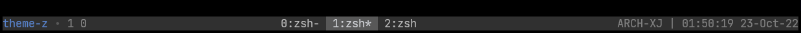
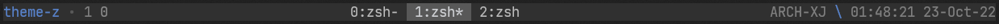
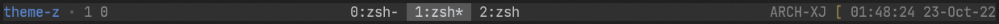
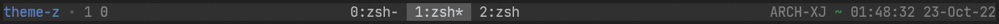
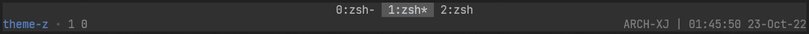
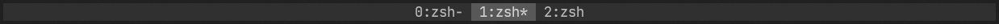

# tmux-theme-z

base on [tmux-themepack](https://github.com/jimeh/tmux-themepack), intergrate [tmux-prefix-highlight](https://github.com/tmux-plugins/tmux-prefix-highlight) and [tmux-split-statusbar](https://github.com/charlietag/tmux-split-statusbar).



empty :


prefix :


copy :


sync :


split statusbar :


hide statusbar :


  
## Usage
### Instal using [Tmux Plugin Manager](https://github.com/tmux-plugins/tpm)

1.  Add plugin to the list of TPM plugins in `.tmux.conf` :

        set -g @plugin 'xj11400/tmux-theme-z'

2.  Press `prefix + I` to fetch the plugin and source it.

### Install manually

1.  Clone repo :

        git clone https://github.com/xj11400/tmux-theme-z.git ~/.tmux/tmux-theme-z

2.  Source it in your `~/.tmux.conf` :

        run-shell "~/.tmux/tmux-theme-z.tmux"

    In some linux distributions you might have to remove the quotation marks
    from the `source-file` command to avoid a `no such file or directory` error :

        run-shell ~/.tmux/tmux-theme-z.tmux

3.  Save the file and reload tmux config.

        tmux source-file ~/.tmux.conf

## Configurations

### default

```
# prompt
set -g  @z-prefix-prefix-prompt "\\"
set -g  @z-prefix-copy-prompt "\["
set -g  @z-prefix-sync-prompt "\~"
set -g  @z-prefix-empty-prompt "\|"

# style
set -g  @z-prefix-prefix-style "fg=blue,bg=default"
set -g  @z-prefix-copy-style "fg=yellow,bg=default"
set -g  @z-prefix-sync-style "fg=green,bg=default"
set -g  @z-prefix-empty-style "fg=colour244,bg=default"

# prefix suffix
set -g  @z-prefix-output-prefix " "
set -g  @z-prefix-output-suffix " "
```

### prefix highlight

Using [tmux-prefix-highlight](https://github.com/tmux-plugins/tmux-prefix-highlight) config instead of `@z-prefix-*` :

```
set -g @z-prefix-highlight-conf 'on'
```

### split statusbar

Disable split statusbar (default is enable) :

```
set -g @z-split-statusbar 'off'
```

Support [tmux-split-statusbar](https://github.com/charlietag/tmux-split-statusbar) config.

## Customization

Using `#{@z_prefix_highlight}` to show prefix highlight in `z.tmuxtheme`.

## Base on

- [tmux-themepack](https://github.com/jimeh/tmux-themepack)

- [tmux-prefix-highlight](https://github.com/tmux-plugins/tmux-prefix-highlight)

- [tmux-split-statusbar](https://github.com/charlietag/tmux-split-statusbar)
